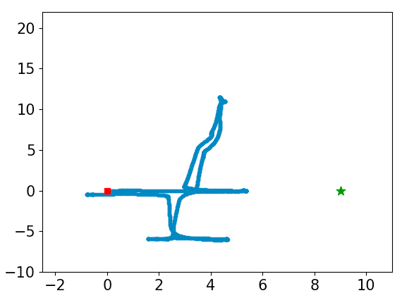
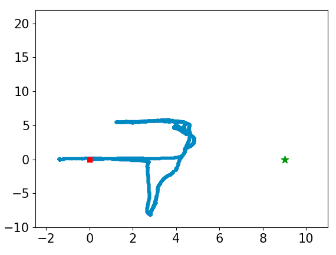
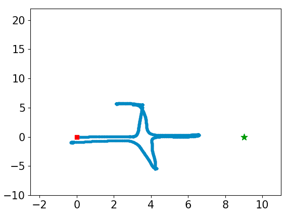
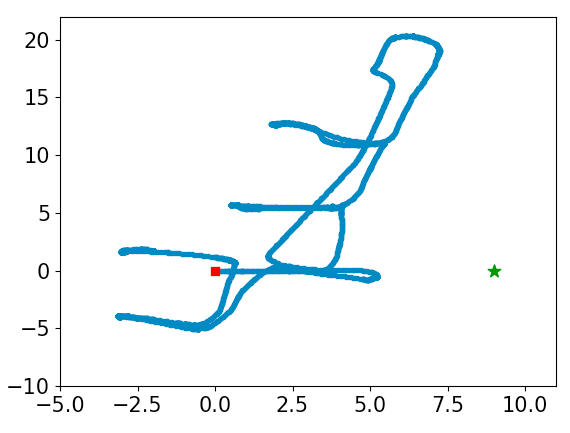
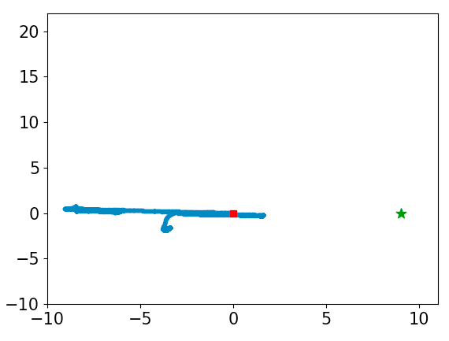

# Overview
This repository contains the datasets used in particle filter localization of a fixed Wi-Fi Access Point (AP). The datasets contain robot path locations, odometry data, and RSSI measurements captured from a robot with multiple receivers moving in an environment. The datasets have the same structure and the data is all obtained from within the same environment.

# Dataset structure
| attribute #   | attribute name | attribute description                                     |
| ------------- | -------------  | --------------------------------------------------------- |
| 0             | temp_step      | irregular sequence count                                  |
| 1             | temp_sec       | time stamp in sec.                                        |
| 2             | temp_nsec      | time stamp in nanosec.                                    |
| 3             | robot_pos_x    | robot position (m.) on x-axis with 0 as starting position |
| 4             | robot_pos_y    | robot position (m.) on y-axis with 0 as starting position |
| 5             | robot_w_x      | part of orientation of robot in quaternion format         |
| 6             | robot_w_y      | part of orientation of robot in quaternion format         |
| 7             | robot_w_z      | part of orientation of robot in quaternion format         |
| 8             | robot_w_w      | part of orientation of robot in quaternion format         |
| 9             | theta_p        | direction (degrees) of onboard camera                     |
| 10            | UL_level*      | filtered RSSI value obtained from upper left antenna      |
| 11            | UR_level*      | filtered RSSI value obtained from upper right antenna     |
| 12            | LL_level*      | filtered RSSI value obtained from lower left antenna      |
| 13            | LR_level*      | filtered RSSI value obtained from lower right antenna     |
| 14            | C_level*       | filtered RSSI value obtained from center antenna          |
| 15            | UL_level_a     | RSSI value obtained from upper left antenna               |
| 16            | UR_level_a     | RSSI value obtained from upper right antenna              |
| 17            | LL_level_a     | RSSI value obtained from lower left antenna               |
| 18            | LR_level_a     | RSSI value obtained from lower right antenna              |
| 19            | C_level_a      | RSSI value obtained from center antenna                   |
| 20            | Feedback       | reserves for future use                                   |

*filtered RSSI values are calculated from RSSI values as described in eq. (8) of:  
S. Caccamo, R. Parasuraman, F. Båberg and P. Ögren, "Extending a UGV teleoperation FLC interface with wireless network connectivity information," 2015 IEEE/RSJ International Conference on Intelligent Robots and Systems (IROS), Hamburg, 2015, pp. 4305-4312, doi: 10.1109/IROS.2015.7353987.

# Experimental setup
All data in the datasets is obtained from a 20-meter x 26-meter indoor office hall with multiple rooms. The path taken by the robot, however, is different in the datasets. The robot begins at (0, 0) in all of the datasets and the Wi-Fi AP is located at (9, 0) in every dataset. The robot obtains RSSI measurements using multiple receivers (located at the upper left, upper right, lower left, and lower right corners of the robot and the center of the robot) with directional antennae. The distance from the lower antennae to the upper antennae is 1.2 m and the distance from the right antennae to the left antennae is 1 m.  
  
Below are figures displaying the paths the robot takes in the environment in datasets 1-5, sequentially. The paths for datasets 6 and 7 are not shown as the robot does not move in the x-y plane but instead spins on its axis for a period of time. The red square indicates the starting position of the robot and the green star indicates the position of the Wi-Fi AP. All axis markers are in meters.  

  

# Related publication
R. Parashar and R. Parasuraman, "Particle Filter Based Localization of Access Points Using Direction of Arrival on Mobile Robots". In Vehicular Technology Conference VTC-Fall 2020.
